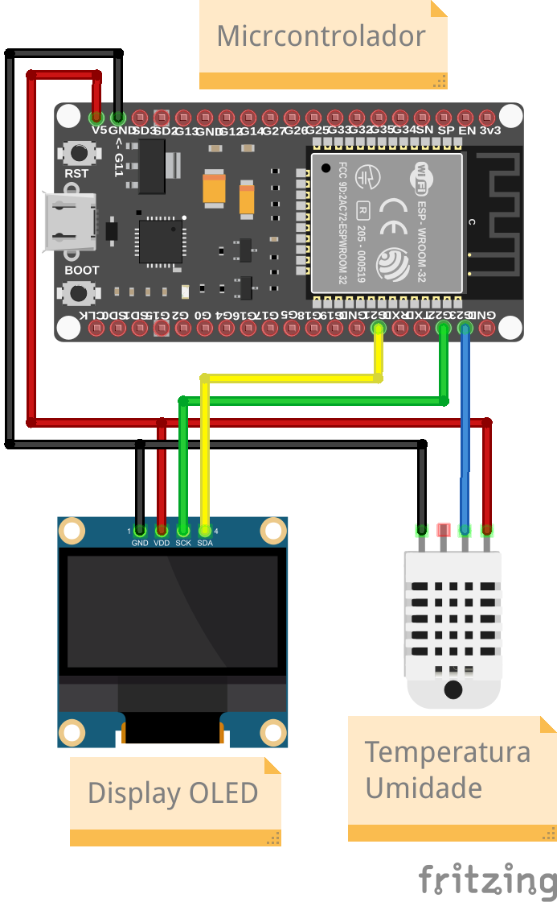

# Mini relógio de rua

### Componentes
---

- `ESP-32`: O microcontrolador que recebe os dados dos sensores.
- `DHT22` ou `DHT11`: Responsável por medir a temperatura e umidade do ambiente.
- `Display OLED`: Responsável pela parte visual do dispositivo.

### Bibliotecas Utilizadas
---

As bibliotecas de terceiros utilizadas para desenvolver esse projeto estão dentro da pasta `bibliotecas`, sendo elas:

- `DHT`: Responsável pela coleta de temperatura e umidade do módulo `DHT22` ou `DHT11`.
- `Adafruit_BusIO`, `Adafruit_GFX`, `Adafruit_SSD1306`: Responsáveis pelo funcionamento do `Display OLED`.

As demais bibliotecas utilizadas são bibliotecas disponibilizadas pela instalação padrão do `Arduino IDE` e importação dos pacotes de placas do `ESP-32`.

### Esquemático do Projeto
---

Aqui encontra-se como o projeto foi e deve ser montado:
